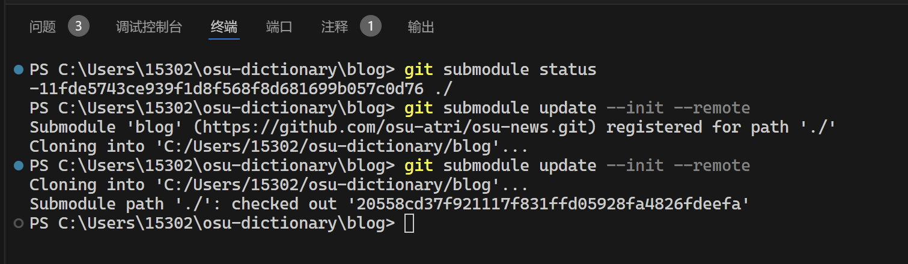

---
date:
  created: 2024-07-12
tags:
  - git
  - submodule
  - coding
  - tools
categories:
  - Coding
comments: true
---
# Git Submodule 特性简述

!!! info "提示"

    关于 Git Submodule 的详细信息，可先阅读[官方文档](https://git-scm.com/docs/gitsubmodules)，此文档给出了子模块的一些基本概念；

    关于 `git submodule` 命令的具体用法，请看[这篇文档](https://git-scm.com/docs/git-submodule)。

相对于其他来说，Git 子模块是 Git 中比较新兴的概念。本篇文章就我的日常开发经历入手，讲述使用子模块时遇到的问题及理解。<!-- more -->

## 正确地初始化子模块

官方给出的方法是直接使用 `git submodule add`，它会做如下事情：

- 在指定的位置 clone 子模块仓库（因此如果目标目录非空会报错）
- 将你的子模块信息写入 `.gitmodule` 与 `.git/config`
  - `.gitmodule` 作为可追踪的文件，随主仓库提交日后使用
  - `.git/config` 被忽略，仅限本地使用

如果有手改子模块配置的需求，请一并修改上述*两*个文件，以避免一些不一致的问题。以及 `.gitmodule` 的优先级是更高的。

## Clone 仓库后加载子模块

以*正常*的方式从网上拉仓库（`git clone`）后，子模块*不会*自动加载。但对于部分编辑器，子模块所在的文件夹可能已被打上了可疑的标记：


此时若打开子模块，会发现是空的。这时这个目录只是作为一个*占位符*出现，并未被赋予实质性的意义。

因此需要手动将其初始化：

```sh
git submodule init path/to/submodule
```

当然，更好的方法是在 Clone 时就安置好子模块：

```sh
git clone --recurse-submodules <repo-URL>
```

!!! warning "版本相关"

    按照上文方式 Clone 出来的仓库，使用的子模块可能与子仓库的最新版本并不一致。

    如果遇到了这类问题，请继续阅读下文。

## 子模块的版本问题

??? "鸣谢"

    感谢 [@NaughtyChas](https://github.com/NaughtyChas) 在实现过程中提出了这个有价值的问题！

    在这里看看案例仓库：[osu-atri](https://github.com/osu-atri/osu-dictionary)，目前位于 `dev` 分支。

    这里也参照了 StackOverflow 上的问题：[Update Git submodule to latest commit on origin](https://stackoverflow.com/questions/5828324/update-git-submodule-to-latest-commit-on-origin) 与 [Pull latest changes for all git submodules](https://stackoverflow.com/questions/1030169/pull-latest-changes-for-all-git-submodules)

在克隆仓库时，我们很少会一下子关注到仓库引用的子模块版本。容易理解，出于稳定性的考虑，除非用户明确指示，Git 默认会按照主仓库存放的子模块信息，拉取对应的子模块提交。（因此如果子仓库的对应提交受到重写/改动，则 Git 无法定位并失败）

同样地，所有对子模块引用的更改必须在主仓库进行（也就是必须在主仓库中，将它作为子模块操作）。这里我可能讲得不太清楚，贴一张 GitHub 子模块显示的图，其中显示了引用的提交，或许更好理解：


也可以在对应的子模块目录下，运行 `git submodule status` 来验证。

对于这种情况，如果我们需要引用子模块的最新提交，可以使用 `--remote` 参数：

```sh
git submodule update --remote
```

如果你的子模块还没初始化，可以加一个 `--init`：

```sh
git submodule update --init --remote
```



在这之后，Git 会将子模块认定为更改，以便提交入主仓库：

```sh
$ git status
On branch dev
Your branch is up to date with 'origin/dev'.

Changes not staged for commit:
  (use "git add <file>..." to update what will be committed)
  (use "git restore <file>..." to discard changes in working directory)
        modified:   blog (new commits)

no changes added to commit (use "git add" and/or "git commit -a")
```

Git 输出的差异比较如下：

```diff
diff --git a/blog b/blog
index 11fde57..20558cd 160000
--- a/blog
+++ b/blog
@@ -1 +1 @@
-Subproject commit 11fde5743ce939f1d8f568f8d681699b057c0d76
+Subproject commit 20558cd37f921117f831ffd05928fa4826fdeefa
```

至此，子模块版本更新，大功告成！
