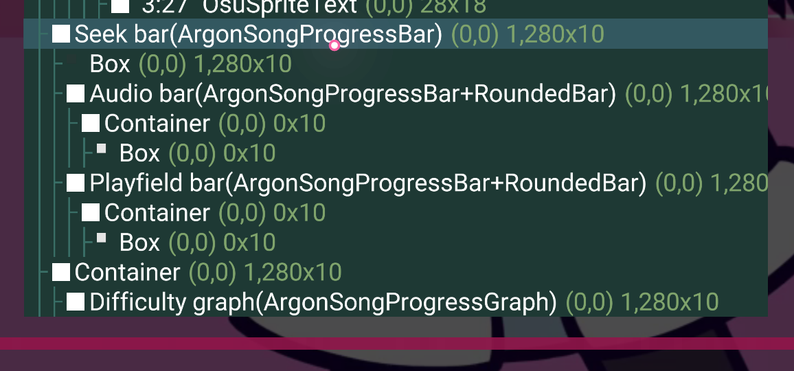

---
date:
  created: 2024-10-07
tags:
  - Projects
  - coding
comments: true
---

# osu!lazer 游戏进度提示条制作

!!! info "来源"
    本文的内容基于作者在 [osu!lazer GitHub 仓库](https://github.com/ppy/osu)做出的一些改动，具体的拉取请求在[这里](https://github.com/ppy/osu/pull/30078)。

恰逢国庆黄金周，在狂打藕酥的时候，偶然（因为图打不动去到编辑器看图了解一下）注意到谱面编辑器里，在光标悬停在时间轴上的特殊区域时，会显示对应时间与相关信息的功能。


稍微了解了一下，这个是 [2024.718.0](https://osu.ppy.sh/home/changelog/lazer/2024.718.0) 版本新加入的功能，主要目的是让对 lazer 编辑器还不熟悉的人简单了解不同颜色的含义。

与 stable 相比，osu!lazer 加入了回放过程中快速定位 (Seeking) 的功能，可以通过使用键盘方向键、右侧控制区的按钮粗略调节，也可以用光标在进度条上点击，实现比较精细的控制。

不过对于某些用户来讲，基本的进度条定位可能没法满足要求：目前在点击或者拖动进度条的时候，要结合进度条的长度与位置做一点估算，代价是定位不准；对于要精确到秒的定位，可能会更加麻烦。

对照游玩时底部显示的进度条，二者本质有一点相似。如此可以考虑，给游玩界面底部的进度条也加入相关的提示显示功能，从而实现更加精确的定位与跳转。

## 调查

为了找到恰当的位置写相关代码与实现功能，需要先找到相关的类与代码。

对于工具条内容，这里建议直接在代码里搜索字符串（例如 `kiai time`），工具条这种比较通用的组件用查看器很难抓到。通过这种方法可以查找到 `EffectPointVisualisation` 类内部的 `KiaiVisualisation` 类，派生了 `IHasTooltip` 接口：

```csharp
private partial class KiaiVisualisation : Circle, IHasTooltip
{
    private readonly double startTime;
    private readonly double endTime;
    public KiaiVisualisation(double startTime, double endTime)
    {
        this.startTime = startTime;
        this.endTime = endTime;
    }
    public LocalisableString TooltipText => $"{startTime.ToEditorFormattedString()} - {endTime.ToEditorFormattedString()} kiai time";
}
```

发现这个之后，就可以尝试用 `TooltipText` 来更改工具条的显示内容。

---

而对于进度条，可以使用组件查看器来查找：



在代码中对应的是 `ArgonSongProgressBar`，如此确定了基本方向。

## 初步实现

在实现过程中有一些需要考虑的问题：

- 如何获得光标所在处对应的时间与进度
- 如何让工具条及其内容随光标位置而更新
- 若光标在进度条外部该如何处理

对于光标对应信息的获取，我觉得可以从组件本身入手，即获取光标相对于*进度条*的 **X** 位置与进度条实际绘制的宽度 (`DrawWidth`) 属性，而后计算出所占比例，进而转化成时间与百分比。而对于光标位置的获取，最直接的方法是获取一个 `InputManager` 的实例。对于光标位置的更新最初写在了类的 `update()` 部分：

```csharp
protected override void Update()
{
    base.Update();
    if (inputManager != null)
    {
        // Update the cursor position in time
        var cursorPosition = inputManager.CurrentState.Mouse.Position;
        relativePositionX = ToLocalSpace(cursorPosition).X;
    }
    else
    {
        // If null (e.g. before the game starts), try getting the input manager again
        inputManager = GetContainingInputManager();
    }
    /* ... */
}
```

从坐标到相关信息的转化过程：

```csharp
private float relativePositionX;

private InputManager? inputManager;

public LocalisableString TooltipText => $"{(relativePositionX > 0 ? (EndTime - StartTime) * relativePositionX / DrawWidth : relativePositionX > DrawWidth ? EndTime : 0).ToEditorFormattedString()}"
    + $" - {(relativePositionX > 0 ? Math.Round(relativePositionX / DrawWidth * 100, 2) : relativePositionX > DrawWidth ? 100 : 0)}%";
```

这一阶段的实现代码可以在[这里](https://github.com/ppy/osu/pull/30078/commits/4f16ecdf1b5bd1dffff3ee00b13c977058ec0558)找到。

## 再度改进

> **peppy** commented *Oct 7, 2024, 1:32 PM GMT+8*:
>
> @CloneWith I rewrote every line. Please read through carefully to understand what was lacking.

基于 osu!lazer 几位主要开发者的指正，发现这种实现方法有很多可以改进的地方（不符合规范）：

- 对于一个组件级别的类，直接获取 `InputManager` 显得过于多余且累赘（因为除此之外没有其他用处了）；
- 用 Lambda 表达式写工具字符串很长一大堆，从维护与审查方面来讲都很困难；
- `ToEditorFormattedString()` 函数给出的时间显示精确到毫秒，精度过高；
- 比较多的非标准格式化（应该去使用 CSharp 自带的格式）。

### 坐标获取改写

> There's no way this is required to make this work. You can get the local position of the mouse by using `OnMouseMove` instead and handling the event.

坐标获取方面，更轻量的方法是重写 `OnMouseMove()` 函数，从 `ValueChangedEvent` 获取光标的坐标值。

```csharp
protected override bool OnMouseMove(MouseMoveEvent e)
{
    base.OnMouseMove(e);

    lastMouseX = e.MousePosition.X;
    return false;
}
```

### 阐释我的码

令人忍俊不禁的是，这个是 peppy 经过重写后的版本（具体[提交记录见此](https://github.com/ppy/osu/pull/30078/commits/6e4eed657ccf520e110f64c9aa4772a647a68b34)），作者曾在[这里](https://github.com/ppy/osu/pull/30078/commits/2d7fdaf89271da7fc93516b82c5f301f9a2510cd)写过比较离谱的代码：

```csharp
protected override bool OnMouseMove(MouseMoveEvent e)
{
    base.OnMouseMove(e);

    var cursorPosition = e.ScreenSpaceMousePosition;
    relativePositionX = ToLocalSpace(cursorPosition).X;

    return true;
}
```

后来想想，是两方面没搞懂导致的：

- `ValueChangedEvent` 中的光标相关值，是屏幕上的绝对坐标还是相对坐标，相对于整个客户端还是这个组件。
- `OnMouseMove` 的返回值有何作用。

结合函数说明可以理解，`e.ScreenSpaceMousePosition` 对应的是光标在**整个屏幕**的绝对位置；`ToLocalSpace()` 函数则将其转化成**本地**的位置，也就是关于**组件**的相对位置。这两步得到的鼠标位置与 `e.MousePosition` 是等效的。

对于 `OnMouseMove`，有内置的用法文档：

> Returns: Whether to block the event from propagating to other Drawables in the hierarchy.

也就是说，返回 `true` 时，光标移动的事件不会传给所在层次中的其他组件，那些组件也就不会接收到光标移动的事件，反之则会。这种情况下进度条并非独占移动事件，所以需要“穿透”。

### 格式化与重构

> This updates with far too much precision. Rounding should be applied to round % to 1% and time to at least seconds. Looks bad right now when scrubbing.

osu!lazer 的工具条在数值更新时会轻微闪烁，同时尺寸会按照内容量而变化，因此会造成上述问题。在不改动基础组件的情况下，比较好的方法是降低精度（例如时间精确到一秒，百分比精确到小数点后一位）。同时也要考虑解决如下问题：

> **bdach** commented:
>
> Holy heck this is unreadable. Nested ternaries? Everything inlined? Why though?
>
> Please split this to an actual method with actual variables thanks.
>
> Also for percentage formatting you should be using the P standard format spec rather than rolling your own.

对这个观点最好的证明就是，我在第一天写了这段代码，两天之后他们审查的时候，已经完全看不懂自己在写啥了。😅

这种表达式最好是分到单独的**一段函数**中去计算。因为只有工具条文本用到，就可以直接用作 getter

```csharp
public LocalisableString TooltipText
{
    get
    {
        // 把 progress 的数值限定在 0 ~ 1 范围内
        double progress = Math.Clamp(relativePositionX, 0, DrawWidth) / DrawWidth;

        // 获取光标处对应时间
        TimeSpan currentSpan = TimeSpan.FromMilliseconds(Math.Round((EndTime - StartTime) * progress));

        // 拆分出分和秒
        int seconds = currentSpan.Duration().Seconds;
        // 依照进度条的时间显示样式，把小时数与分钟数合并
        int minutes = (int)Math.Floor(currentSpan.Duration().TotalMinutes);

        // 形如 "114:51 (19%)"
        return $"{minutes}:{seconds:D2} ({progress:P0})";
    }
}
```

CSharp 的时间格式化可以参考[这篇文章（模板）](https://learn.microsoft.com/en-us/dotnet/standard/base-types/standard-timespan-format-strings)；对于其他比较常见的数字格式化，可以看看[这一篇](https://learn.microsoft.com/en-us/dotnet/standard/base-types/standard-numeric-format-strings)。

## 实际效果

最终这个功能被提上了下个发布版本的日程，实现效果如下：


出于测试目的，这个功能暂时只支持 Argon 样式的进度条，其他样式的支持或许日后也有可能？

开发功底不足，还是得靠韭菜盒子来补））
