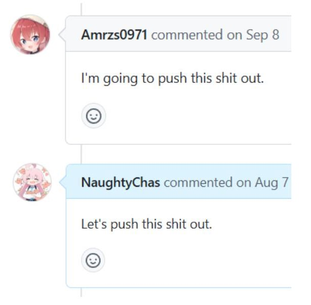

# 主页

***Welcome to my home on GitHub!***

我是 **CloneWith**，中文名**复予**。很高兴见到你！

- 寻找合作项目说明请点 `关于合作 Collaboration`
- osu!danser 入门指南请点 `osu!`
- 翻译表、本地化相关请点 `Translation`
- 开发日志请点 `Code`

!!! info "To English readers"
    This site features mainly *Simplified Chinese* articles.

## 关于我 {#about}

你所热爱的，就是你的生活。

- 学生党
- 编程 : 开源项目
- 本地化与国际化
- osu! 萌新（货真价实的萌新喵，主打 **STD（一点）与 CTB（很多）**）
- 入门 Mapper（目前处于调整期）

## 联系 {#contact}

如果你有什么想问问我的问题，可以私信我。我会很乐意帮你解答！

要找到联系方式，滚动到页面底部，右下角的图标悬停即可。建议你使用**哔哩哔哩私信**或者 **Discord**。

比较正式的内容（如合作请求）请不吝直接发送邮件。

不保证能够及时回复 xD

## 赛博合影 {#collabs}

### Dolly on GitHub

第一次，抽象且幽默...有一种**说的道理**的美。

!!! info "热知识"
    `Shit` 是我们对仓库中所做提交的爱称，其原意源远流长，最早可追溯到**说的道理**，常因造型独特、动作抽象而被网友称作`史`。

    在这里，我们同样延续了这个传奇般的名字。具体解释请见下文。

    同样地，*说的道理*的英文名是 **Short Dolly**。

可以这么理解

整个仓库就是一个大厂房

一个分支是一个factory

commit把史堆积起来

PR完成了 产品线合并了，史就推出来了（

!!! tip "???"
    怎么样，要做个结构图抽象一下嘛？

<map name="dollymap">
  <area shape="circ" coords="29.5,33.5,20.5" href="https://osu.ppy.sh/users/30973609" alt="Amrzs0971" />
  <area shape="circ" coords="32,180,20" href="https://osu.ppy.sh/users/15349720" alt="Naughty_chas" />
  <area shape="rect" coords="77.5,25.5,148.5,43.5" href="https://osu.ppy.sh/users/30973609" alt="Amrzs0971" />
  <area shape="rect" coords="78,171.5,161,191" href="https://osu.ppy.sh/users/15349720" alt="Naughty_chas" />
</map>
