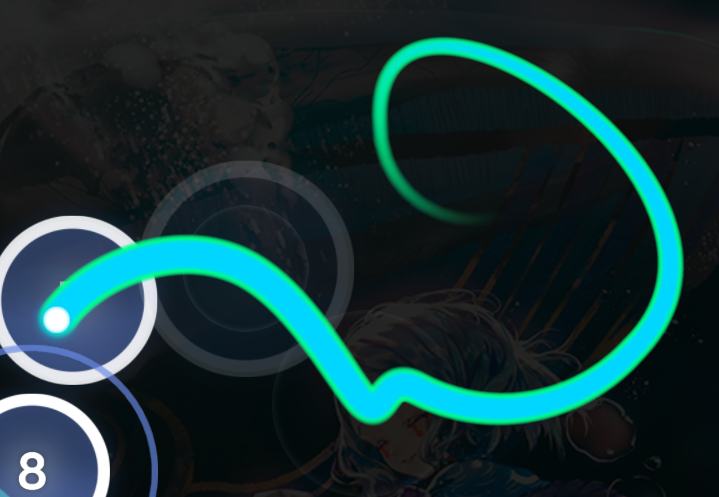
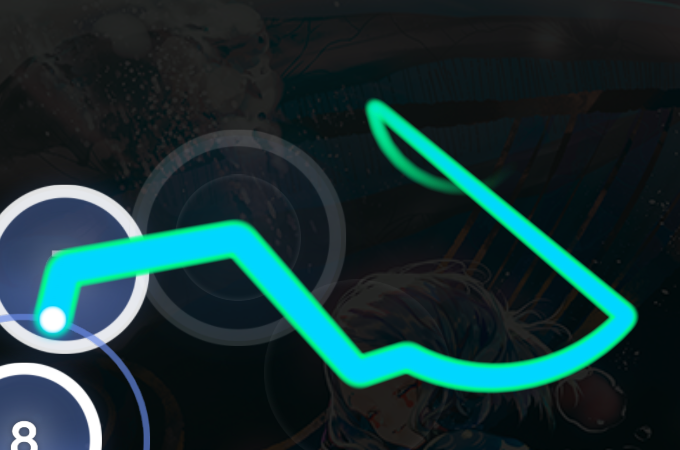
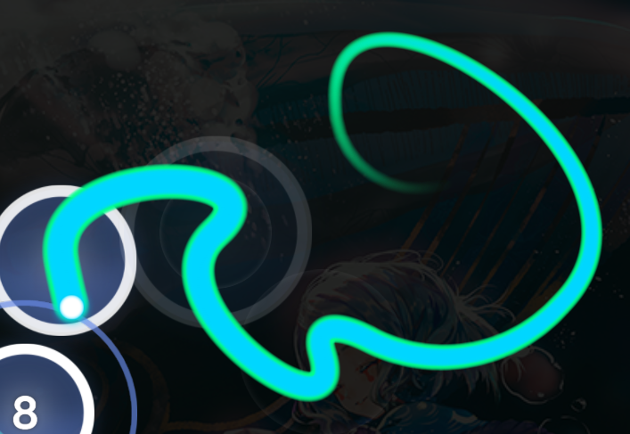
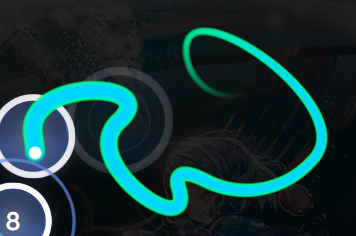
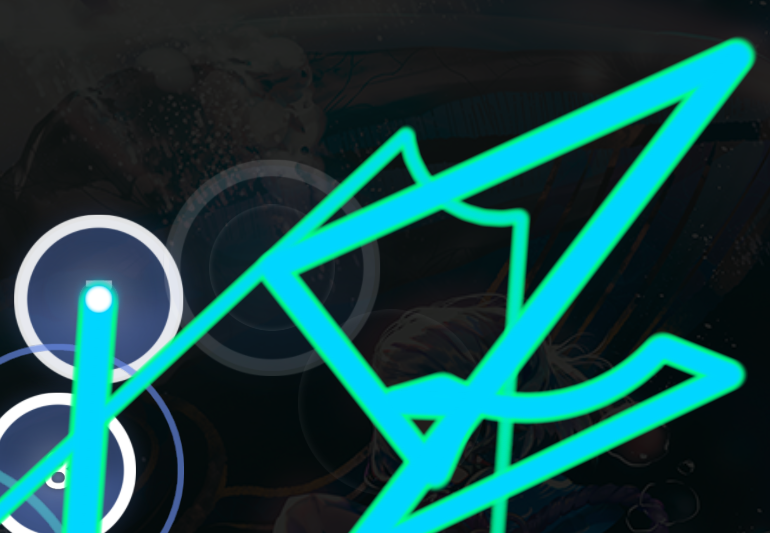
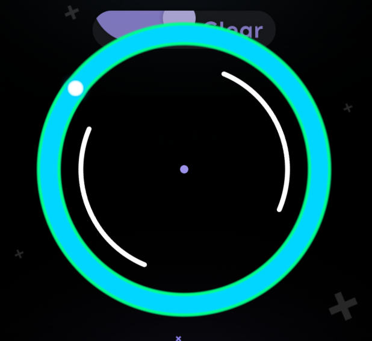
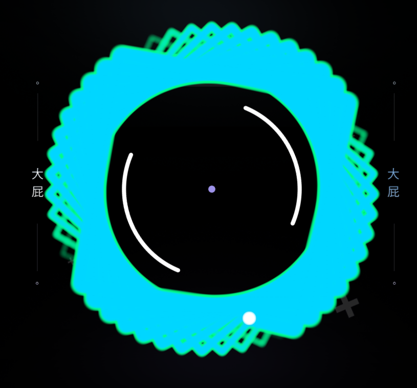
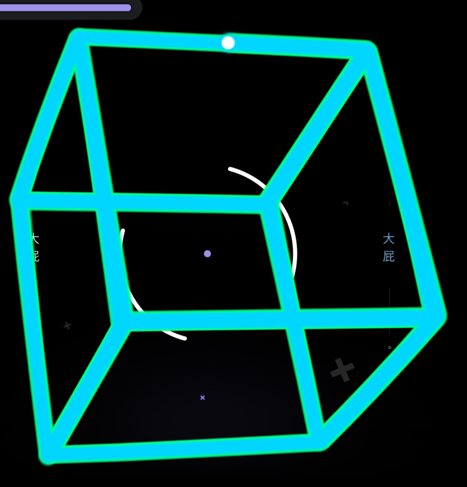
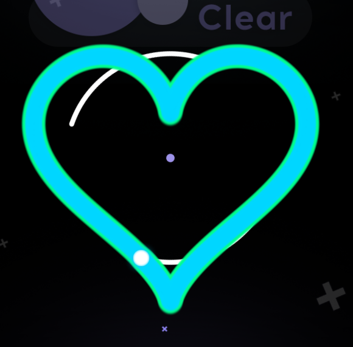

---
tags:
  - osu!danser
  - guide
  - WIP
wip: true
comments: true
---

# osu!danser 入门指南 - 3

此文章将简述 osu!danser 中光标、物件显示的自定义，以及 cursor dance 中不同模板的运动特性。


osu!danser 新年的背景飘雪动画，很好看。

## 颜色设置 {#colour-general}

osu!danser 中的光标（及轨迹）、打击圈与滑条都可以自定义颜色。取决于设置对象，给出的设置也许会有所不同，但大体上一致。以下数值均以度 (°) 为单位：

| 参数 | 介绍 |
| :-- | :-- |
| `Enable Rainbow` | 对象使用彩虹颜色，即颜色随时间变化 |
| `Rainbow Speed` | 每秒旋转的颜色度数 |
| `Basic Color` | 基准颜色，彩虹的起始颜色 |
| `Enable Custom Hue Offset` | 自己设置色调偏移 |
| `Flash to the beat` | 元素随节奏闪烁 |
| `Flash amplitude` | 闪烁亮度 |

如果使用的是皮肤光标/物件皮肤，则会覆盖这里的颜色设置。

对于色调旋转我还不太明白其中原理，先把颜色算法记在这里：

```go
// settings/color.go
func (cl *color) Update(delta float64) {
 if cl.EnableRainbow {
  cl.currentHue += cl.RainbowSpeed / 1000.0 * delta

  cl.currentHue = mutils.Sanitize(cl.currentHue, 360)
 } else {
  cl.currentHue = 0
 }
}

func (cl *color) GetColors(divides int, beatScale, alpha float64) []color2.Color {
 flashOffset := 0.0
 if cl.FlashToTheBeat {
  flashOffset = cl.FlashAmplitude * (beatScale - 1.0) / (Audio.BeatScale - 1)
 }

 hue := mutils.Sanitize(cl.BaseColor.Hue+cl.currentHue+flashOffset, 360)

 offset := 360.0 / float64(divides)
 if cl.EnableCustomHueOffset {
  offset = cl.HueOffset
 }

 return utils.GetColorsSV(hue, offset, divides, cl.BaseColor.Saturation, cl.BaseColor.Value, alpha)
}
```

## 光标 {#cursor}

光标的常规设置：

| 设置 | 介绍 |
| :-- | :-- |
| `Show cursors on breaks` | 默认情况下休息时段期间光标会飞出屏幕，启用后光标会留在屏幕上 |
| `Bounce on edges` | 光标碰到边缘时反弹 |
| `Cursor ripples` | 点击时出现波纹 |
| `Cursor Smoke` | 显示回放中光标拉出的烟雾轨迹 |

### 轨迹 {#trail}

osu!danser 提供了四种轨迹颜色设置：

| 选项 | 介绍 |
| :-- | :-- |
| `Unified color` | 轨迹颜色保持不变 |
| `Distance-based rainbow` | 轨迹颜色按运动距离渐变 |
| `Time-based rainbow` | 轨迹颜色按时间渐变 |
| `Gradient` | 轨迹颜色按位置渐变 |

其中 `Gradient` 一项颜色的计算式：

```go
hue = float32(settings.Cursor.Style4Shift) * inv / float32(len(cursor.Points))
```

`Style4Shift` -> `Hue Shift`，`Points` -> 位置。

也有一些具体的设置可以精细控制轨迹，如下：

| 设置 | 介绍 |
| :-- | :-- |
| `Trail scale` | 轨迹宽度（即拉出轨迹的半径） |
| `Trail end scale` | 轨迹尾部大小 |
| `Trail density` | 轨迹点间的距离，使用皮肤可以看的清楚些 |
| `Trail max length` | 最长长度，超出此长度的部分会开始消失 |
| `Trail remove speed` | 轨迹消失的速度 |
| `Glow end scale` | 如果轨迹发光，末尾发光的大小 |
| `Relative inner trail length` | 如果轨迹发光，则定义轨迹*本身*的长度 |
| `Additive blending` | 似乎与叠加渲染相关 |

## 物件 {#obj}

与 osu! 相比，osu!danser 在物件绘制方面提供了更大的设置空间。

| 设置 | 介绍 |
| :-- | :-- |
| `Draw approach circles / combo numbers / follow points / Load spinners` | 控制是否显示缩圈、连击数字、物件间轨迹、转盘 |
| `Enable stack leniency` | 使用谱面设置，将重叠物件错开排布 |

### 滑条 {#slider}

| 设置 | 介绍 |
| :-- | :-- |
| `Draw end circles / slider follow circle / score points` | 控制是否显示滑条尾的圆圈、跟随圈、得分点 |
| `Slider merge` | 将不同滑条间重合的部分合并为一体。可能会影响可读性，但在观赏图使用也许会很美观 |
| `Border width` | 滑条外围线宽度 |
| `Snaking in / out` | 滑条逐渐滑入滑出 |

除此之外，滑条包括头部、主体、尾部、得分点各部分都可以设置颜色与透明度。

## Danser

osu!danser 的一大特色，在于光标自由美观的运动。B 站上似乎已经有展示光标运动的视频，这里用文字的方式叙述。

可以使用一些设置控制其属性：

| 设置 | 介绍 |
| :-- | :-- |
| `Combo tag` | 勾选后，每个光标完成一组连击而非一个物件 |
| `Battle` | 同时完成整张谱面 |
| `Do spinners together` | 同时旋转转盘而非由单个光标完成 |
| `TAG slider dance` | 接力完成滑条 |
| `Slider dance` | 在滑条路径内部，**将每个滑条点/折返点视作单个物件**进行运动 |

关于 Slider dance，这里给出对比图：


蓝色轨迹是未开启 `Slider dance` 的光标，而绿色是已开启的。

### 多模式控制 {#multi}

Danser 的运动模式可以按 **常规** 与 **转盘** 单独设置。每个设置小节中的加号、减号用于管理不同模式，同一小节下的所有模式中，优先级**自上而下降序排列**，即靠前的优先使用。

如果设置了多个模式，则会一一组合分配到每个 tag danser；若模式数不足，则会自动循环添加。如果一个模式下有多项配置原理亦相同，会依照同模式配置个数进行分配。

比如分配设置如下：

- Tags: 6
- Movers: Spline, Momentum, Pippi, Spline
- Spinners: Cube, Heart
- Spline Mover 设置了 2 个模式

则游玩时所有的 danser：

| ID | Mover | Spinner |
| :-: | :-: | :-: |
| 0 | Spline.**0** | Cube |
| 1 | Momentum | Heart |
| 2 | Pippi | Cube |
| 3 | Spline.**1** | Heart |
| 4 | Spline.**0** | Cube |
| 5 | Momentum | Heart |

### 动作 {#motion}

osu!danser 提供了多种不同的预设动作，如下：

#### Mover

| 名称 | 动作 | 图例 |
| :-- | :-- | :-: |
| Spline |  |  |
| Beizer | 贝塞尔曲线 |  |
| Circular | 在物件之间画半圆 |  |
| Linear | 直线连接物件中心 |  |
| Axis | 每次只沿 X / Y 轴方向移动 |  |
| Aggressive | 突转的曲线 |  |
| Flower | 花瓣形 |  |
| Momentum | 动量曲线 |  |
| Exgon | 全屏幕直线乱动 |  |
| Pippi | 擦边打击 |  |

#### Spinner

| 名称 | 动作 | 图例 |
| :-- | :-- | :-: |
| Circle | 沿圆圈旋转，最正常的转盘 |  |
| Triangle | 三角形 |  |
| Square | 正方形 |  |
| Cube | 旋转的立方体 |  |
| Heart | 心形 |  |

---

各种 Danser 的特性，大家可以自己探索。
