---
tags:
  - Games
  - osu!
  - meme
comments: true
---

# 一些模因

该把什么放在这边呢？我也不知道，反正就是些很有趣的东西。看看图一乐

## 有趣的聊天

### 水是剧毒的

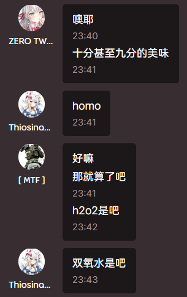
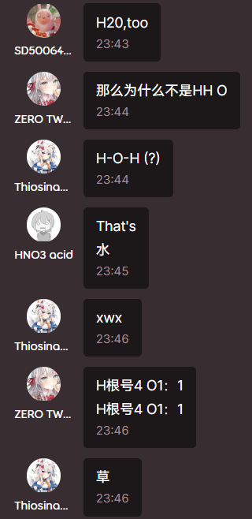

### 日常变猫娘

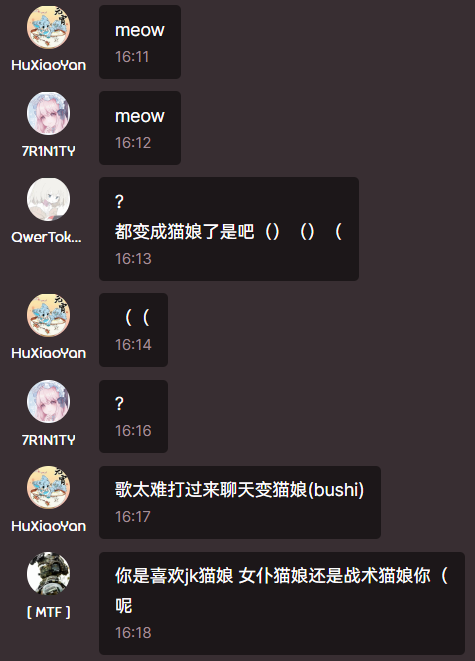

羡慕猫娘（bushi

### 会见老外(?)

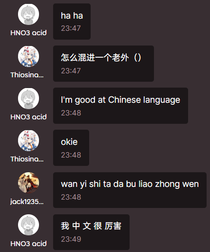
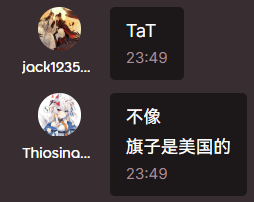
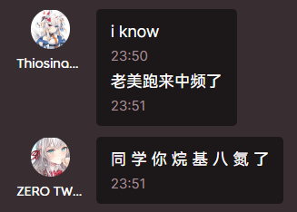
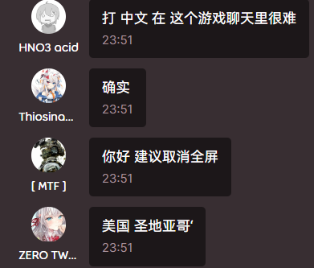

---

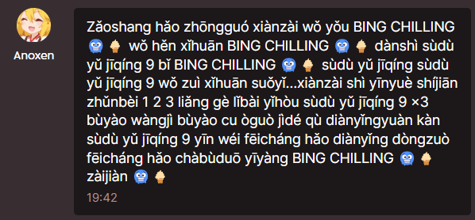

## 奇怪的数字又增加了

你完全可以发现一些很完美的数字。

??? info "展开"
    逸一时，误一世！

## 小科普

### Firetruck

经查 属于一种较为委婉的**发泄方式** 使用例见下：

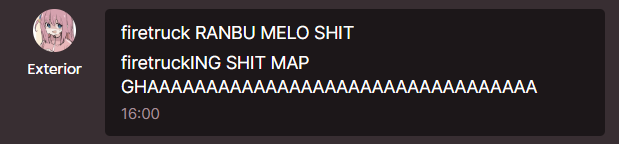

---

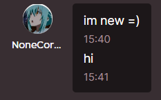
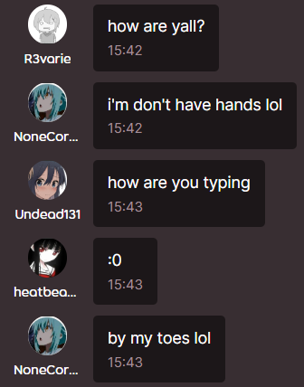
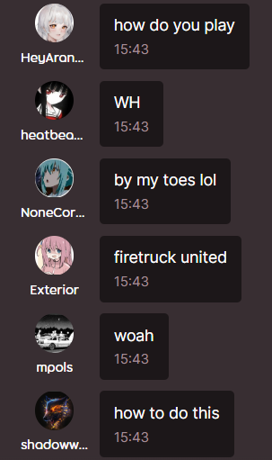

### 安安

`碎觉，走路安安，ag安安，小磨牙安安，抽口气安安，咖喱安安，粟米安安，圆圈安安，显卡安安，薯片安安，大伙安安，可能在的喵白也安安`

我想这应该属于请安吧？那又为什么呢？奇怪的问题又增加了。
