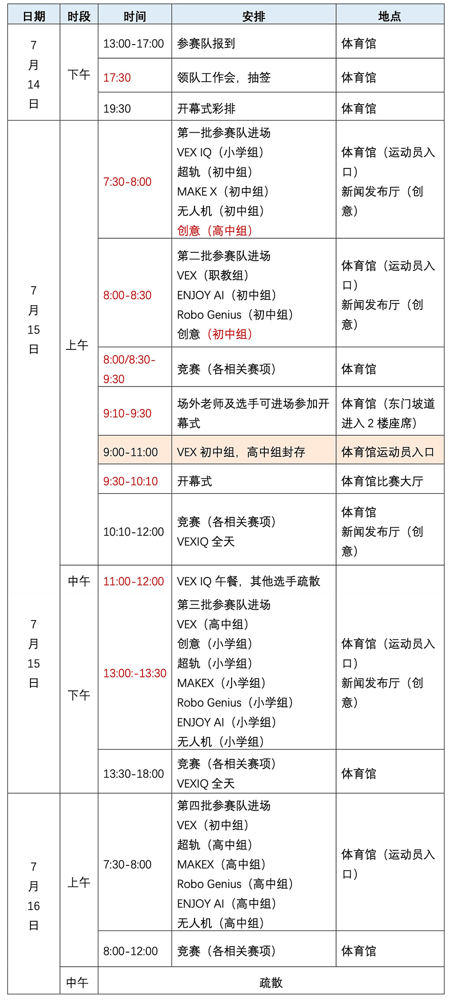
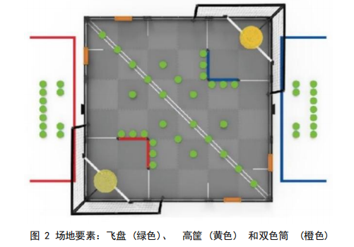
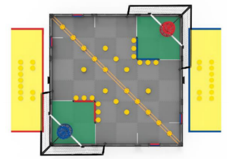
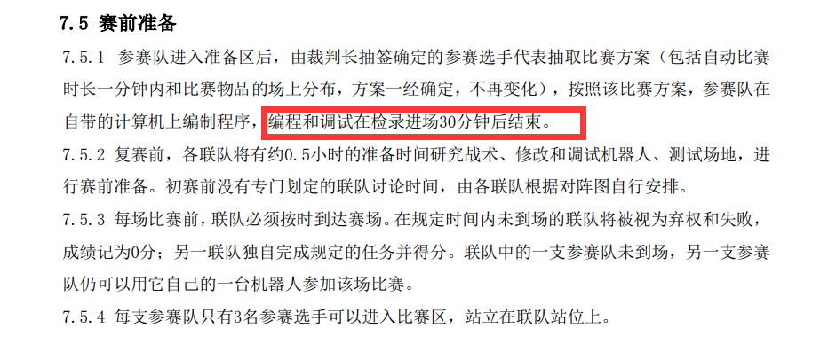
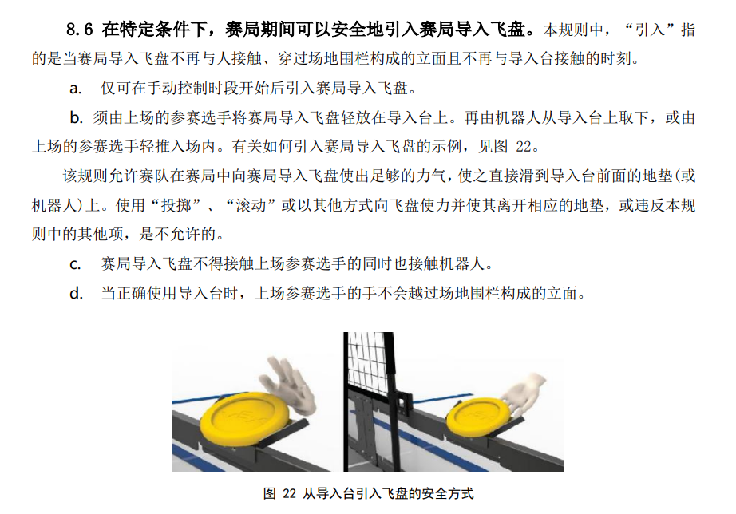

---
tags:
  - VEX
  - robotics
  - experience
---

# VEX 赛事的一些东西 - 概览

VEX 机器人的省级赛事已于 `2023-07-14` 结束。

对于我们学校而言，VEX 机器人赛事和 Yanshee 机器人赛事（优创未来）一部分时间线是重合的，因此时间阶段上大体是相近的。这篇文章主要讲述赛程安排。

[省科教平台发布的通知](https://www.jsstem.org/News/noticeView.aspx?AID=252878)，可能有一些用处。

## 赛程安排 {#arrange}

2023 年的省 VEX 机器人挑战赛在泰州体育公园举办。自然，全名是**第二十二届江苏省青少年机器人竞赛**（[主站链接](http://carc.njtaike.com/)），是和数个其他项目共用的室内体育馆。主办方给场地做了一个简略的划分，所有参赛队分不同时间段，按批次报到、上场。

下面给出赛程安排的图。不同届次的时间安排大抵有出入，仅供参考。

## 规则 {#rules}

江苏省发布了省赛特定的规则，与 VEX 官方的规则可能不同。下方链接下载：

- [原链接见此](http://cxfs.njtaike.com/upload/beditor/file/20230710/1688978701138848.pdf)。

这里选出几个重点列在下面：

### 主题 {#theme}

VEX初中、高中及职教组的主题为“扭转乾坤”。

每场比赛包含两种不同类型控制方式：手动和自动控制。比赛的特点是两支参赛队组成联队，每支参赛队各派出一台机器人，在赛场上完成各种任务。在对抗赛中，两支联队(红队和蓝队)各由两支赛队组成，在包含前 15 ~ 30 秒自动赛时段和后 120 秒自动时间的手动控制时段的赛局中竞争。

赛局目标是通过使用飞盘得分，占据双色筒和赛局结束时覆盖场地泡沫垫，以获得比对方联队更高的得分。自动赛时段结束时，任意联队占据两个双色筒，且有至少两个飞盘在高筐得分，将获得自动获胜分。在自动赛时段得分最高的联队将获得自动时段奖励分。

### 场地元素 {#object}

**比赛场地：**

3600mm × 3600mm 的比赛场地，四周有高约 282mm、厚 25 ～ 35mm 的铁质围栏。围栏内的场地表面由发泡塑料块拼接而成，底色为灰色。

**场地要素：**

- 60 个飞盘；
  - 8 个作为初始预装，双方联队各 4 个；
  - 14 个作为赛局导入物，双方联队各 7 个；
  - 38 个在场地上的初始位置。（所有飞盘具体摆放根据抽签图）
- 4 个双色筒；
- 2 个高筐，双方联队各 1 个；
- 2 组网，每个高筐后 1 组；
- 2 个导入台，双方联队站位区前各 1 个。

### 记分 {#scoring}

| 规则 | 得分 |
| :-: | :-: |
| 每个在高筐内得分的飞盘 | 5 分 |
| 每个在领地内得分的飞盘 | 1 分 |
| 每个被占据的双色筒 | 10 分 |
| 每块被覆盖的泡沫垫 | 3 分 |
| 赢得自动时段奖励分 | 10 分 |

上面规则的判定标准还是很严格的，一般不会轻易判你得分。在比赛期间一定要等裁判初次判决结束后，再举手同意或提出申诉。

### 流程 {#procedure}

- 初赛随机组队，2v2 对战；
- 前 8 名进入复赛，继续随机组队，2v2；
- 进入半决赛 2v2，决赛 1v1，分胜者、败者组。

此外，初赛开始前（即进场后）会有半小时时间进行调试与初步准备。初赛、复赛期间由于裁判需要统计分数晋级，所以可能会有人为的 15 分钟左右休息时间。

在比赛进行时，一般选手是不能直接接触场地的，导入飞盘除外。

## 杂谈 {#misc}

学校今年组了两支队伍前去参赛，一支队伍进入复赛获得季军（最后颁发的是省二等奖），另外一支省三等奖。另外的一些事情请见杂谈文。
