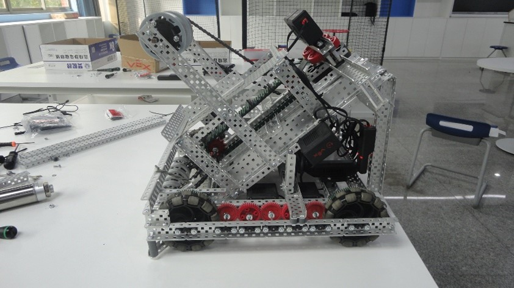

---
tags:
  - VEX
  - Robotics
---

# VEX 赛事的一些东西 - 硬件篇

与 Yanshee 机器人的树莓派开发板、固定的机身不同，VEX 机器人通过给出有限的组件与工具，只需凭借你的想象力，即可
搭建出无限可能造型的机器人，从硬件上就给予了我们无限自由发挥（~~整活~~）的空间。这篇文章将讲述我们在搭建机器人结构过程中的思考。

## 基本零件 {#basic}

小到螺丝螺母，大到金属构件，甚至各式传感器和遥控器，VEX 机器人有成百上千的零配件，但赛场上实际应用的为数不多。为此，VEX 官方以及中国大陆的一些经销商提供了套装售卖，以便课堂教学到专业赛事的不同受众需要。

通过在相关网站上查阅，我收集到了与赛事相关的零件套装如下。

!!! info "参考资料"

    作者对各位读者的耐心与身体素质感到担心。因此，为了缩短篇幅、优化结构，零件列表可转到[这里](/robotic/VEX-Robotics/misc/note-meta)阅读。

学校目前选用的是若干 (4?) 套教学套装，以及所谓的“竞赛套装”两套。

## 模型搭建 {#proto}

对于一般用途的 VEX 机器人，官方给出了若干模型方案，我们学校选用的是这两种：

- Clawbot 钳爪机器人（高一、高二社团的教学用机）
- Disco 履带机器人（官方赛事原型机使用）

出于套装组件不足以及时间限制（以及经费不足，笑），我们社团的参赛机器人是基于 Disco 履带机器人的模型改装的，一个队伍使用一台，贴标签分开使用。如果遇到机器损坏这样的特殊情况，也会共用。

## 进一步改进 {#improvement}

在观看冠军队伍的介绍视频后，由于深感不足，在时间较为充足（指距赛事还有 2 个月）的情况下，我们开始对原型机进行改装。

在初步检查时，发现两台机器有下列问题：

- 飞盘弹射区域的亚克力板将近破裂；
- 底盘的齿轮磨损严重（基本上转动时会磨出白色粉末）；
- 底盘大概率卡飞盘、卡斜坡；
  - 卡飞盘：指机器人从 >= 1 个飞盘上径直经过（没有用轮子推开）时，底盘被垫起，四个轮子悬空，完全无法脱身的情况。
  - 卡斜坡：指机器人失误冲上地面 1 分得分区的槛上时，一侧轮子悬空，完全无法脱身的情况。
- 弹射区的飞轮一直找不到合适长度的螺丝，导致快速旋转时大概率发出撞击声 & 转速下降；
- 各处电机损坏（高强度练习所致）；

我想上述问题，可能是赛事用机器以及基于 Disco 改装的机器的通病（零件组装的问题除外）。这些问题很烦，因为在练习期间会强制分隔连续时间（中途如果掉零件了都要去检查）；万一练习时没有这样的问题，在赛场上出了问题，说不定就会 `wdnmd`！

经过与工程师交流，我们确定了一下解决方案。当时写在了社团教室的黑板上来着，这里做成表格，方便读者阅读：

| 解决方案 | 优先级[^1] | 预计完成 | 实际完成 |
| :-- | :-: | :-: | :-: |
| 置换所有不合适的零件 | 高 | 2 天 | 5 天 |
| 去除底盘横梁 | 高 | 3 分钟 | 3 分钟 |
| 置换电机 | 高 | 1 天 | 5 天[^2] |
| 引入“空间占据”装置 | 高 | 1 个月 | 比赛当天凌晨 1:20[^3] |

这是我们人工智能社团，引以为豪的**高·效·执·行·力**！（笑）

---

[^1]: 所有事务优先级都是`高` www

[^2]: 这里算进了快递运送的 3 天

[^3]: 即《深夜工房》 参见[这里](/robotic/VEX-Robotics/VEX-3#midnight)

---

最终完工后，赶着 Deadline 顺手写好了工程笔记...[点这里查看](/robotic/VEX-Robotics/misc/note-hard)

### 占场地装置的讨论 {#expand}

这个所谓的“占场地”装置，我想和读者讨论一下是很有意义的。

根据目前从网上搜集到的信息以及小组讨论研究出的结果，主要有以下两种可实现的形式：

- 碰撞触发类
- 电子开关类

由于碰撞触发类往往不够精确，且涉嫌破坏场地，因此在比赛中常常不被采用。我们就用了电子开关，通过气缸驱动杠杆来实现，并将其绑定到手柄按键上。使用的气缸套装，在上文的配件表中已列出，感兴趣的读者可以浏览一下。

很不幸，纵使使用气缸，亦有使用方式上的区别：

- 弹射类：气缸杠杆到达一定长度，释放拉紧的橡皮筋/绳，带配重向某方向弹射出去。
  - 反对：弹射方向不确定 & 支点无处安置（Disco 钢架结构复杂）
- 重力类：气缸杠杆前后移动（回缩较佳），使其上构件自然掉落，而后机器人通过移动将绳子延展开来。
  - 反对：摩擦力影响 & 配重大小不定

在比赛前一周内，我们社团的成员都纠结在这两种延展方式的利弊上，甚至引发了几次争吵（支持和反对双方都很不满呢）。因此发生了上文[那件事](/robotic/VEX-Robotics/VEX-3#midnight)。

最终选择了使用重力类：发现总机械师 D 同学的想法很好，借用机器人弹射区结构与机器人 Brain 间的小空间，在两根竖向铝条间固定 T 形组件，单向气缸横向置于其上，伸缩杆上放有小钢条，一段与绳连接，绳的另一头与内部结构固定。主要选择的原因是因为稳定性高且搭建简单、省事，效率高。

在赛场上发现，其实延展结构哪有说的这么稳定啊？用这个装置唯一的成果，是初赛第一局手动赛时段，配重在 10 秒倒计时前意外掉落，DQ 一局，让对方直接半场开香槟~

当然也不得不提之后的赛事中，气缸弹射装置给整个机器增加了重量，对抗中屡屡占得上风，最后获得了季军这件事...

这就叫“塞翁失马，焉知非福”吗？我不明白。
