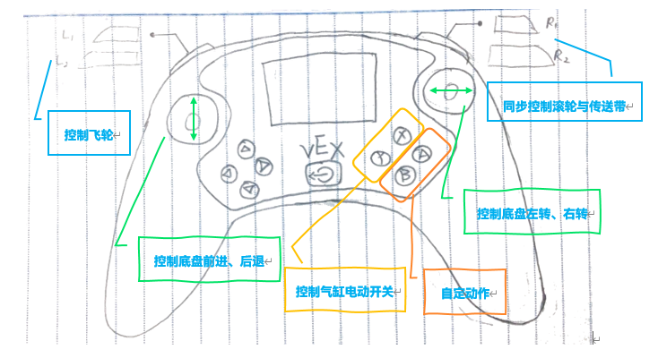
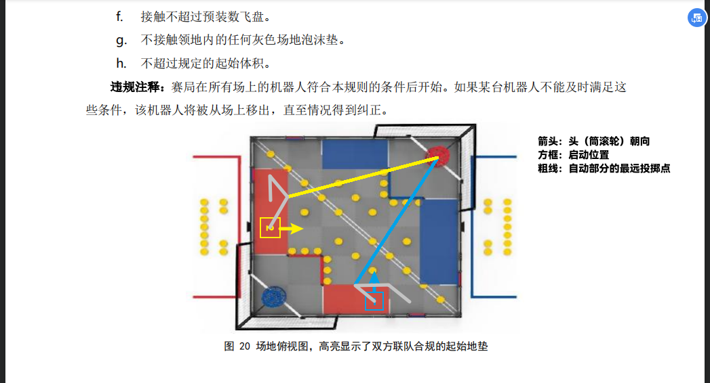

---
tags:
  - VEX
  - robotics
  - coding
---

# VEX 赛事的一些东西 - 程序篇

依靠强大的各种材料、齿轮、电机搭配，加以电子接口、各式传感器的兼容性，使用 VEX 机器人可以通过编程完成一系列事务。这篇文章将从编写参加赛事的程序入手，讲述为 VEX 编写程序的一些有趣细节。

本文的一些内容摘自我们的工程笔记。

## 手动操控程序 {#control}

事实上，手动操控部分是整个程序运作的基础，因为所有的电机动作都需要共用手动操控的电机控制函数来完成。这些函数，是我们和工程师一起合作完成了。

除电机控制外的第二个问题，就是手柄操控设置。熟悉游戏手柄的读者也许会发现，手柄摇杆有“死区”这一设置，主要是为了在保证可操作性的同时，避免小幅移动摇杆导致的误操作。在摇杆操控部分就加入了这一功能。

同时，通过与操控手的探讨与多次实验，我设置好了这样的按键绑定规则：



这里的 A、B 键其实对应着高速、低速投射的功能，它们原来是自动程序部分中的函数，现在为了对战方便也加了进去。

## 自动控制程序 {#auto}

自动赛时段历时 15 秒，初步计划完成以下任务：

1. 机器人初始状态带有两个飞盘，先尝试向高筐射出飞盘。
2. 旋转底盘，使机器人与网格对齐。
3. 机器人前进至位于滚筒左侧，原地转弯，滚动我方滚筒至对应颜色。（这一步之前一直有用，后来注释掉了）

乍一看程序设计的很短，实测在 5 秒内即可完成。但由于硬件设计不够高级，没有把握完成精确度要求高的任务，因此也只能求稳。

### 基本路线设置 {#route}



为了提高机器人执行动作的精确度，我们结合网格线，经过多次测试，加入了以网格为单位的控制函数：

```cpp
void goForwardGrid(int t, bool intake) {}
void goBackwardGrid(int t, bool intake) {}
// 按网格为单位的前进后退，t 表示网格数，intake 声明是否边转滚轮边前进（适用于自动转滚筒）
void turnLefts(float r) {}
void turnRights(float r) {}
// 按固定弧度为单位的左右转弯
void Spin() {}
// 转动滚筒的较低层封装
```

### 数值微调 {#args}

事实上，VEX 机器人无法做到 Yanshee 等智能机器人一般的精细操作，原因如下：

- 体型过大（很多时候这也是个问题）
- 参数过多（好消息 or 坏消息？更多情况下，根本不了解这些有什么用）

因此，上述程序段中的很多参数，都需要提前多次尝试，直到调出一个满意的值才行。我 ~~忙里偷闲~~ 写了一个项目，满足了这个要求。逻辑很简单，读者可以尝试：

- 绑定 3 组不同的按键，对应功率、目标值、限时
- 每组按键用于调整对应值（当然，这里的分度值也要预先估计好）
- 按某个键执行动作

自动化代替手动操作，个人认为是提高效率（摸鱼之路233）的第一步。
